# Feature

## Authentication system

Login, Register, Forgot password

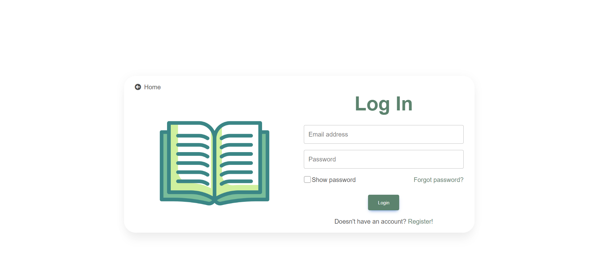
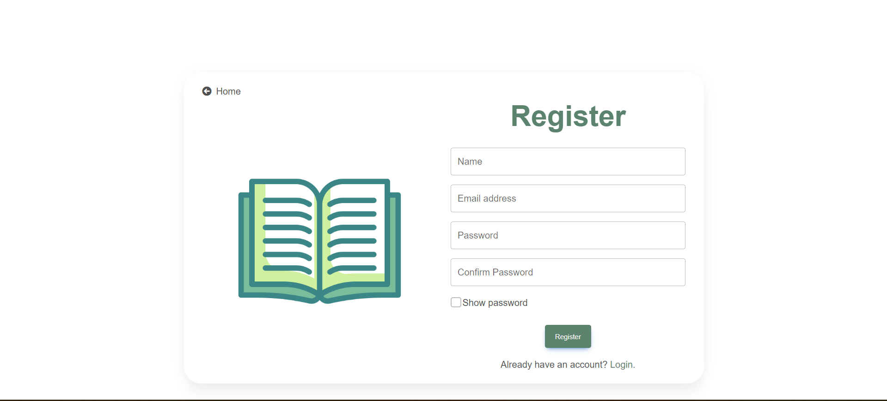
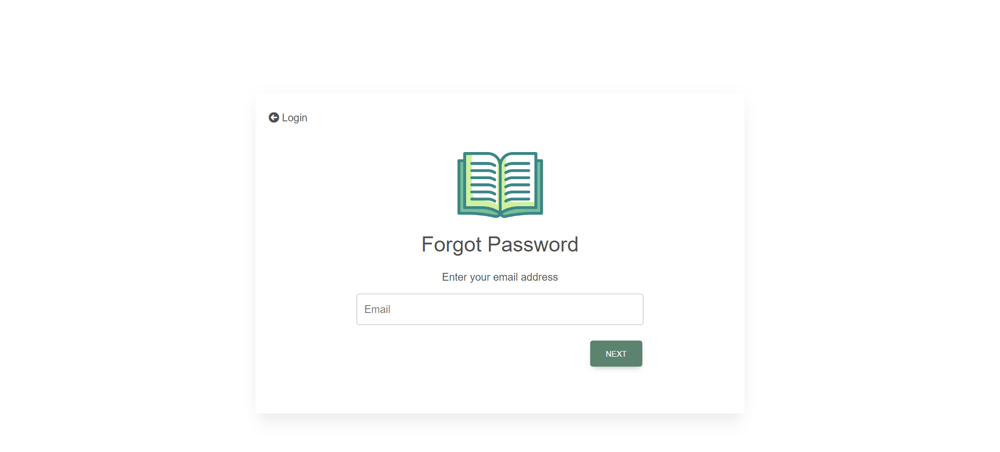
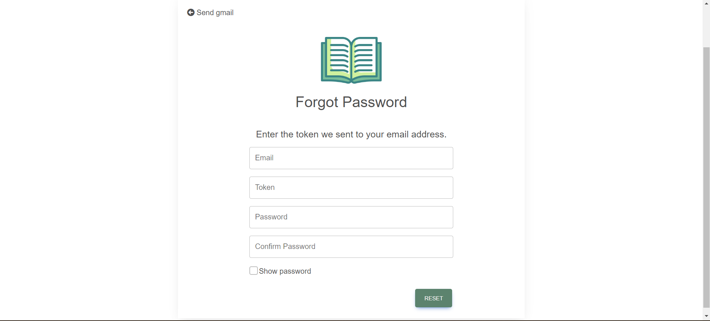

## Profile

Profile's CRUD, View as others

Profile's social media

## Book

Book's CRUD

Search books by title, categories, or availability

Save the book as a favorite

## Book's review

Review's CRUD, like, dislike, notification

## Discussion

Discussion's CRUD, like and dislike, notification

Search discussion by title

## Discussion's comment

Comment's CRUD, like, dislike, notification

## Community

Search the community by name and visibility

Community's CRUD

Community Join request, Notification Join request

Manage members

Community's role

### Functionality
---

Community Admin can assign any member as community admin

Admin can only assign themselves as a member if there is another admin

Admin can only remove themselves from the community if there is another admin

---

## Community's reading challenge

Create a reading challenge

User joins reading challenge

Update reading progress

### Functionality
---
Community members can join the challenge

Non-community members can see the  challenge only for the public community

---

## Banner

Dynamic Banner

## Admin

Admin manages Books, Users, Reviews, and Banner

## Image

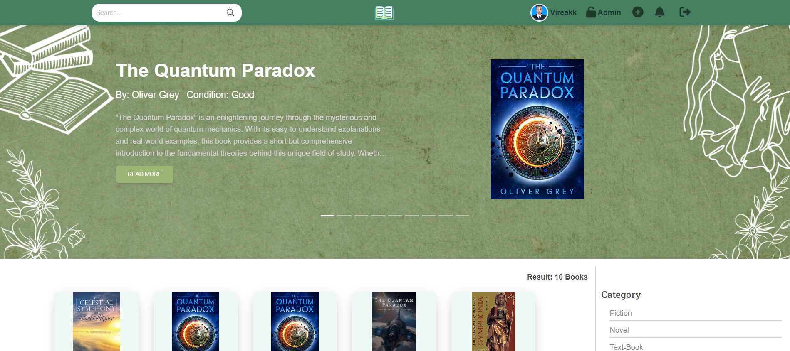
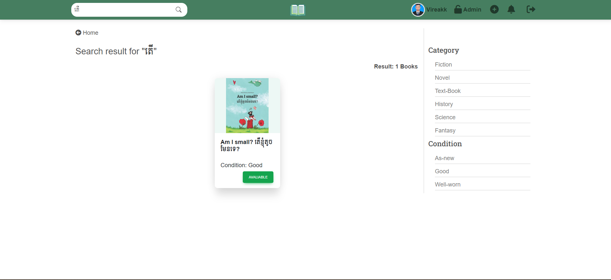
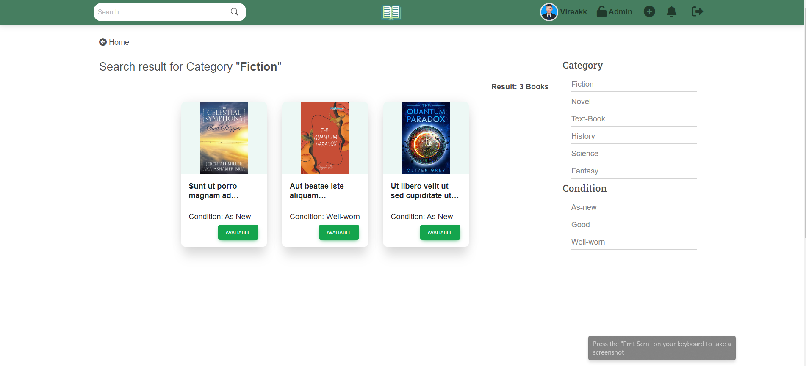
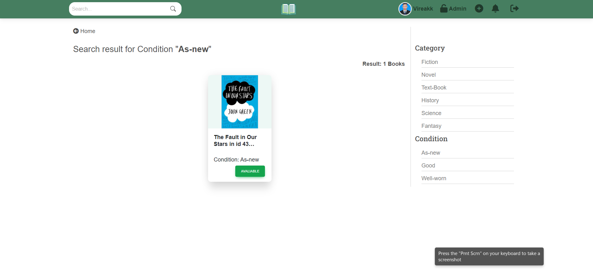
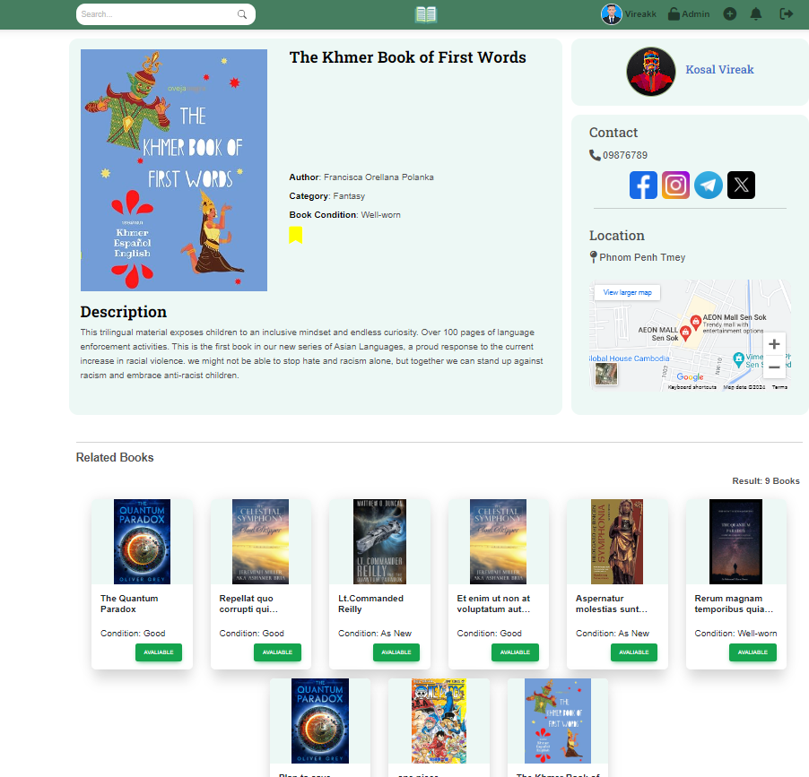
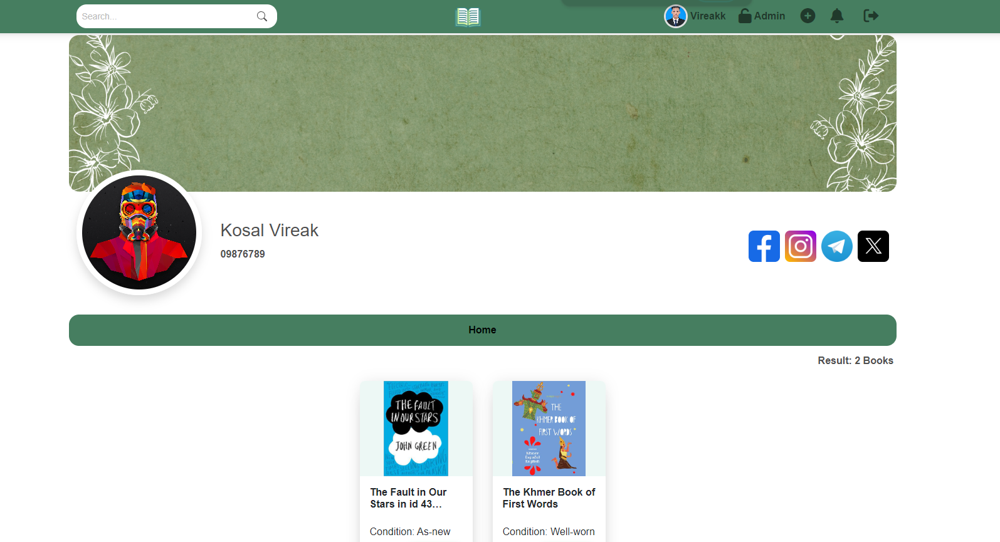
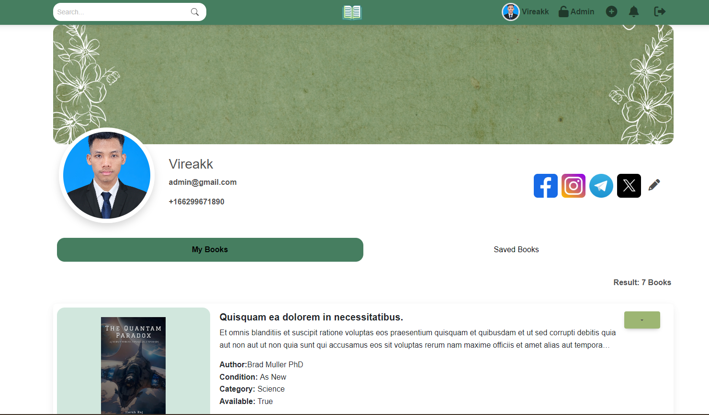
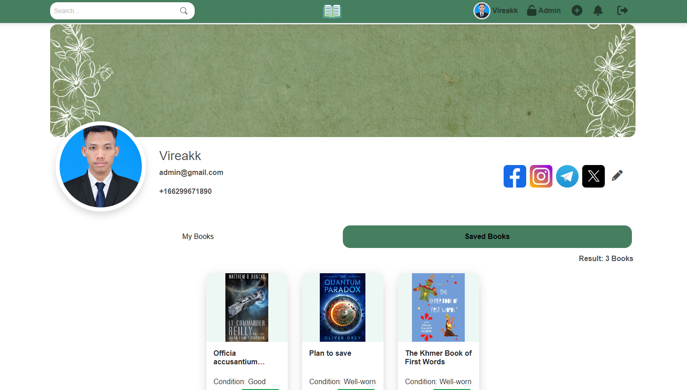
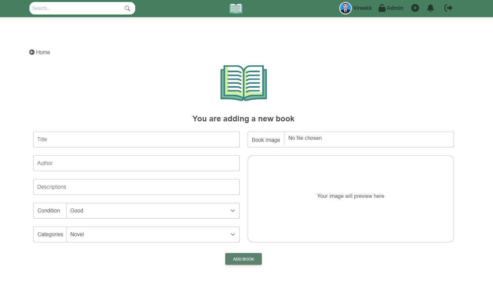
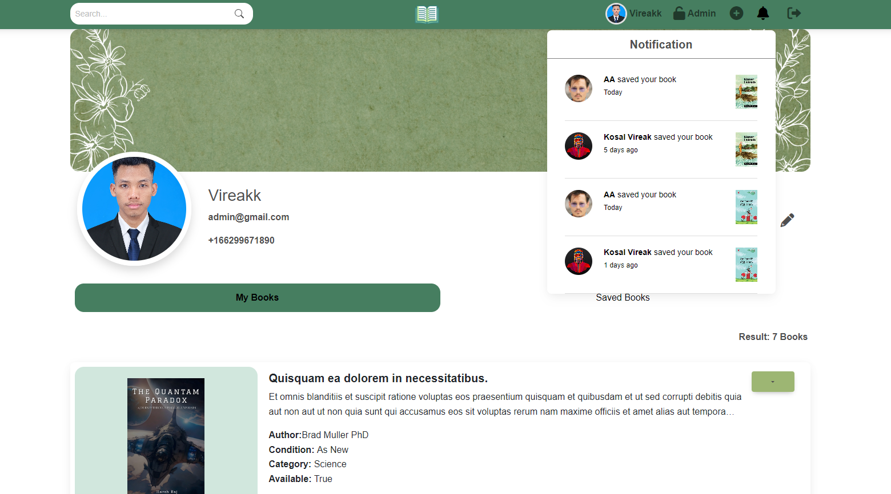
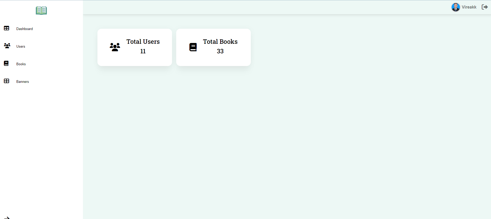
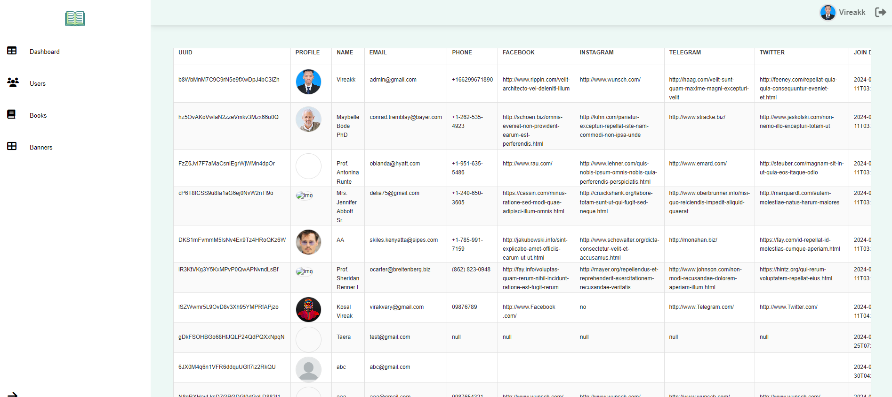
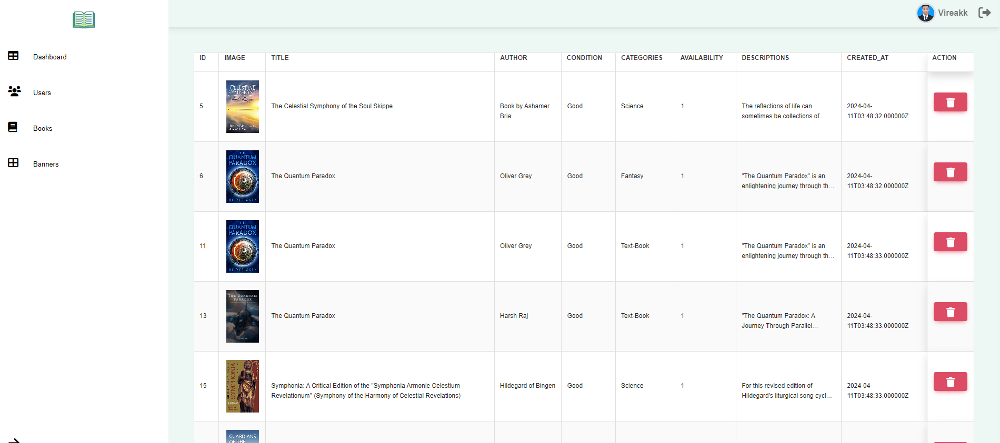
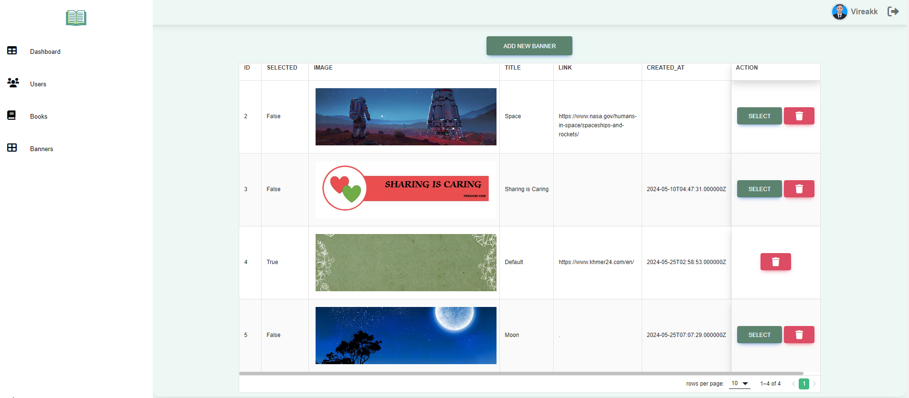
